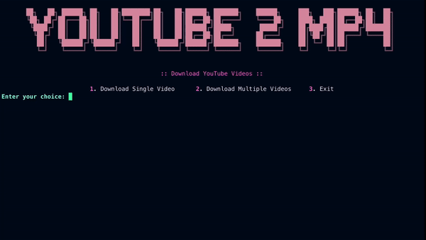

# YouTube 2 MP4
A Python script for downloading YouTube videos in .mp4 format

<div align="center">
  
</div>

## Usage
Clone this repository
```
git clone https://github.com/ibnaleem/youtube-2-mp4.git
```
Install Python dependencies
```
pip install -r requirements.txt
```
Run [`main.py`](https://github.com/ibnaleem/youtube-2-mp4/blob/main/main.py) script
```
python3 main.py
```

## Created with
- [Rich](https://rich.readthedocs.io/en/stable/console.html) - for console style
- [PyTube](https://pytube.io/en/latest/) - for downloading YouTube videos

## License
This repository is under the [MIT License](https://github.com/ibnaleem/youtube-2-mp4/blob/main/LICENSE).
